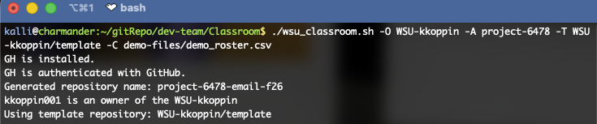
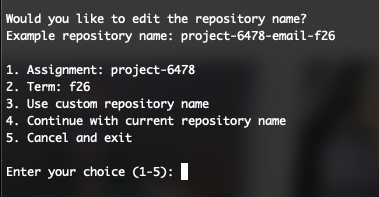
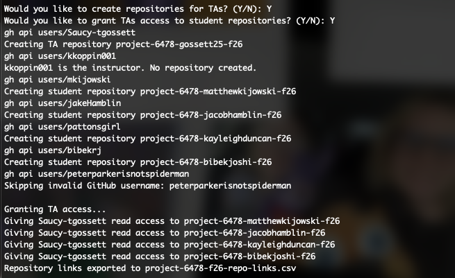
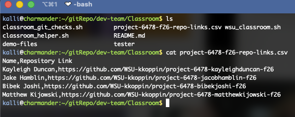
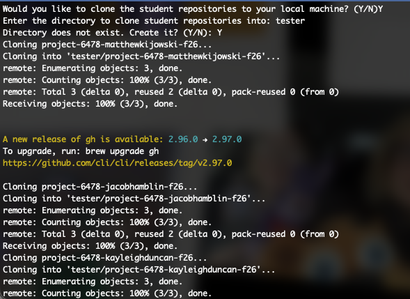
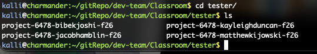
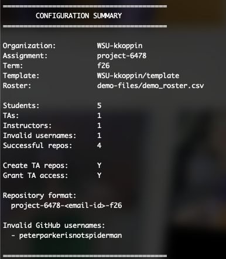

# WSU Classroom

## Quick Start Guide

- Clone this repo: `git@github.com:wrightedu/Classroom.git`
- Install and authenticate the GitHub `gh` tool ([Install Here](https://cli.github.com/))
- Run the `install.sh` script OR `source` the `wsu_classroom.sh` file
  - Or add `source /path/to/wsu-classroom/wsu_classroom.sh` to your `~/.bashrc` and reload
- Get Name, Email, GitHub Username, and Role for your course students
  - Follow the requirements in [Class Roster Format](#class-roster-format)
  - Optionally, use the included Python parser to generate a roster from a Pilot quiz export
    - See [Class Roster Creation](#class-roster-creation)
- Run `WSU_classroom -O <organization> -A <assignment> -T <template> -C <path_to_csv_file>`
  - See [Usage](#usage) for notes

## Contents

- [Overview](#overview)
- [Features](#features)
- [Prerequisites](#prerequisites)
- [Installation](#installation)
- [Class Roster Format](#class-roster-format)
- [Class Roster Creation](#class-roster-creation)
- [Usage](#usage)
- [Repository Naming](#repository-naming)
- [How It Works](#how-it-works)
- [Troubleshooting](#troubleshooting)

## Overview

WSU Classroom is a Bash-based command-line tool designed to simplify the creation and management of GitHub repositories for university courses. It provides an alternative to GitHub Classroom by allowing instructors to create and manage repositories using a class roster and a GitHub template repository.

The tool uses the GitHub CLI to interact with GitHub organizations, create repositories for students, manage repository access for teaching assistants, and generate information instructors can use to manage their course repositories.

## Features

- **Automated Repository Creation** – Creates private repositories for students using a specified GitHub template repository.
- **Roster-Based Creation** – Uses a CSV class roster containing student, TA, and instructor information to determine repository creation and access.
- **Repository Naming** – Automatically generates consistent repository names using the assignment name, student's email identifier, and current academic term.
- **GitHub Validation** – Verifies GitHub CLI installation and authentication, organization ownership, GitHub usernames, and template repositories before performing repository operations.
- **Teaching Assistant Support** – Options to creates repositories for TAs and grant TAs read access to student repositories.
- **Repository Link Export** – Generates a CSV file containing student names and links to their newly created repositories. Output is sorted alphabetically by last name.
- **Repository Cloning** – Provides the option to clone all created student repositories to a specified local directory.
- **Configuration Summary** – Displays a summary after processing, including roster counts and invalid GitHub usernames.

## Prerequisites

- Bash
  - Bash through WSL2 is sufficient
- Git
- GitHub CLI installed & authenticated
- GitHub Organization
  - User should be Owner in GitHub Org
- Template repository
  - template repository may be blank, but must exist.
  - template repositories must be public and the Template Repository setting enabled
- Class Roster CSV File

### Optional

- Python 3
  - Only required when using the optional Pilot quiz parser to generate the Class Roster CSV

## Installation

1. **Clone the Repository**

Clone the WSU Classroom repository:

```bash
git clone git@github.com:wrightedu/Classroom.git
```

Then navigate into the cloned repository.

2. **Keep the Repository Up to Date**

Before using WSU Classroom, make sure your local copy is up to date:

```bash
git pull
```

3. **Source WSU Classroom**

WSU Classroom is intended to be sourced so that the `WSU_classroom` command is available from the user's shell.

Add the following line to your `~/.bashrc`, replacing the path with the location of your cloned WSU Classroom repository:

```bash
source /path/to/wsu-classroom/wsu_classroom.sh
```

4. **Reload the Shell Configuration**

After updating `~/.bashrc`, reload the configuration:

```bash
source ~/.bashrc
```

Alternatively, close and reopen the terminal.

Once configured, the `WSU_classroom` command will be available from the command line.

## Usage

Once WSU Classroom has been installed and configured, run the tool using the `WSU_classroom `command.

```bash
WSU_classroom -O <organization> -A <assignment> -T <template> -C <path_to_csv_file>
```

Example:
```bash
WSU_classroom -C demo-files/duncan_demo_restore.csv -O WSU-kduncan -A test5 -T pattonsgirl/CEG2350-LabTemplate
```

**Flags**

| Option | Argument | Description |
| --- | --- | --- |
| `-h` | None | Displays the help message and exits. |
| `-O` | Organization | Specifies the GitHub organization where repositories will be created. |
| `-A` | Assignment | Specifies the assignment name used to generate repository names. |
| `-T` | Template | Specifies the GitHub template repository used to create student repositories. |
| `-C` | CSV File | Specifies the class roster CSV file to process. |

> [!IMPORTANT]  
> The `-O`, `-A`, `-T`, and `-C` options are required.

When the command is run, WSU Classroom validates the provided configuration and processes the class roster. During execution, the user may be prompted for additional options, including TA repository creation, TA access to student repositories, and cloning student repositories to the local machine.

Use the help option to display the available command-line options:

```bash
WSU_classroom -h
```

## Class Roster Format

The CSV file must use the following column format:

```csv
Name,Email,Role,Username
```

| Column | Description |
| --- | --- |
| `Name` | The first and last name of the roster member. |
| `Email` | The email address used to generate the repository identifier. |
| `Role` | The individual's role in the course. |
| `Username` | The individual's GitHub username. |

### Supported Roles

The following roles are supported:

- **Student** – Receives an invite to a repository created from the specified template.
- **TA** – Script user has options to:
  - create TA's a repository from the specified template
  - grant read access to student repositories.
- **Faculty** – No repository is created. It is assumed that the user is the org owner where the repos are created. Access is inherent to the org owner role.

## Class Roster Creation

WSU Classroom requires a CSV roster using the format described in [Class Roster Format](#class-roster-format).

Users may create this CSV manually or optionally use the included Python parser to generate a roster from a Pilot quiz export.

### Using the Python Parser (Optional)

The included `parser.py` script extracts student information from a Pilot quiz CSV export and converts it into the format required by WSU Classroom.

> [!NOTE]
> Python 3 is only required when using the Pilot quiz parser. It is not required to run WSU Classroom itself.

The Pilot quiz should ask students for:

- Wright State email address
- GitHub username

The parser expects the Pilot CSV export to contain the following columns:

| Pilot Column | Purpose |
| --- | --- |
| `FirstName` | Student's first name |
| `LastName` | Student's last name |
| `Org Defined ID` | Identifies and groups responses from the same student |
| `Q Text` | Contains the Pilot quiz question |
| `Answer Match` | Contains the student's response |

To convert an exported Pilot quiz CSV, run:

```bash
python3 parser.py <pilot_csv_file>
```

For example:

```bash
python3 parser.py pilot_quiz_results.csv
```

The parser creates a file named:

```text
roster.csv
```

The generated roster uses the required WSU Classroom format:

```csv
Name,Email,Role,Username
Jane Doe,doe.1@wright.edu,Student,janedoe
John Smith,smith.2@wright.edu,Student,johnsmith
```

All entries generated by the parser are assigned the `Student` role. TA and Faculty entries must be added to the generated roster manually if needed.

The generated roster can then be passed to WSU Classroom:

```bash
WSU_classroom -O <organization> -A <assignment> -T <template> -C roster.csv
```

## Repository Naming

WSU Classroom automatically generates repository names using the assignment name, the student's email identifier, and the current academic term.

Repository names use the following format:

`<assignment>-<email-id>-<term>`

**For example:**

`project-1-koppin5-f26`

The email identifier is generated using the portion of the student's email address before the @ symbol, with periods removed.

***For example:**

`koppin.5@wright.edu → koppin5`

Academic terms are represented using the following format:

| Term | Format | Example |
| --- | --- | --- |
| Fall | fYY | f26 |
| Spring | sYY | s27 |
| Summer | suYY | su27 |

The academic term is automatically determined based on the current date:

- **January–March:** Spring (sYY)
- **April–June:** Summer (suYY)
- **July–November:** Fall (fYY)
- **December:** Spring of the following year (sYY)

## How it Works

When WSU Classroom is run, the tool performs the following steps:

1. **Checks GitHub CLI** – Verifies that the GitHub CLI is installed and that the user is authenticated.

2. **Processes Command-Line Arguments** – Reads the organization, assignment, template repository, and class roster provided by the user.

3. **Validates the GitHub Organization** – Verifies that the authenticated user has the required access to the specified GitHub organization.

4. **Validates the Template Repository** – Confirms that the specified repository exists and is configured as a GitHub template repository.



5. **Confirms Repository Naming** – Generates the repository naming format and allows the user to modify the assignment, term, or repository naming before continuing.



6. **Checks for Teaching Assistants** – If TAs are present in the class roster, the user can choose whether to create TA repositories and whether TAs should receive read access to student repositories.

7. **Processes the Class Roster** – Reads each entry in the CSV file, validates GitHub usernames, and creates the appropriate repositories based on each individual's role.

8. **Creates Student Repositories** – Creates private student repositories from the specified template and grants each student access to their repository.

9. **Grant TA Access** – If selected, gives TAs read access to the student repositories.



10. **Exports Repository Links** – Creates a CSV file containing student names and links to their generated repositories.



11. **Offers Repository Cloning** – Prompts the user to optionally clone all student repositories to a local directory.





12. **Displays a Configuration Summary** – Displays the configuration and results of the completed operation, including roster counts and invalid usernames.



## Outputs

### Repository Links CSV

A CSV file containing the names of students and links to their generated repositories is automatically created.

The file uses the following naming format:

`<repo-name>-repo-links.csv`

**For example:**

`project-1-f26-repo-links.csv`

The generated CSV uses the following format:

```csv
Name,Repository Link
Jane Doe,https://github.com/organization/project-1-doe1-f26
John Smith,https://github.com/organization/project-1-smith2-f26
```

Repository links are sorted alphabetically by the student's last name.

### Local Repository Clones

If the user chooses to clone student repositories, the repositories are cloned into the local directory specified by the user.

### Configuration Summary

At the end of execution, WSU Classroom displays a configuration summary containing information about the completed operation, including:

- Organization
- Assignment
- Academic term
- Template repository
- Class roster (input csv)
- Number of students, TAs, and instructors
- Number of invalid GitHub usernames
- Number of successfully created repositories
- TA repository and TA repository access selections
- If invalid Github usernames were found, presents name and email of invalid name found

## Troubleshooting

The following are common issues that may occur while using WSU Classroom.

### GitHub CLI Is Not Installed

If WSU Classroom cannot find the GitHub CLI, verify that it is installed:

```bash
gh --version
```

Install the GitHub CLI before running WSU Classroom again.

### GitHub CLI Is Not Authenticated

If the GitHub CLI is installed but not authenticated, log in using:

```bash
gh auth login
```

You can verify the current authentication status with:

```bash
gh auth status
```

### Organization Access Error

The authenticated GitHub user must have the required administrative access to the specified GitHub organization.

If an organization access error occurs, verify that:

- The organization name is correct.
- The correct GitHub account is authenticated.
- The authenticated account has administrative access to the organization.

### Template Repository Error

The repository specified with the -T option must exist and be configured as a GitHub template repository.

If the template cannot be used, verify that:

- The repository name is correct.
- The repository exists.
- The authenticated GitHub account can access the repository.
- The repository is configured as a template repository.

### Class Roster Not Found

If the class roster cannot be found, verify that the path provided with the -C option is correct and that the CSV file exists.

### Invalid GitHub Username

WSU Classroom validates GitHub usernames while processing the class roster. Entries with invalid GitHub usernames are skipped and reported to the user.

Verify that the Username field in the roster contains the individual's correct GitHub username.

### Duplicate Repository Identifier

Repository identifiers are generated from the portion of each email address before the @ symbol with periods removed.

If multiple email addresses generate the same identifier, WSU Classroom will report a duplicate repository identifier and stop processing.

Verify that each roster entry generates a unique email identifier before running the tool again.

### Repository Creation Failure

If a student repository cannot be created, verify that:

- The organization is correct.
- The template repository is accessible.
- The repository does not already exist.
- The authenticated GitHub account has the required permissions.

Review the terminal output and configuration summary for additional information about errors encountered while processing the roster.

### [Back to Top!](#contents)

